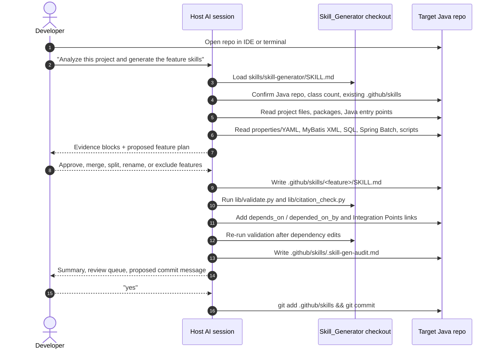

# Agent invocation flow

How a developer goes from opening a Java repo to having durable feature skills
under `.github/skills/`. This is the visual companion to
`skills/skill-generator/SKILL.md`, `skills/skill-tracker/SKILL.md`,
`skills/skill-updater/SKILL.md`, and `skills/skill-validator/SKILL.md`.

---

## Agent responsibilities

| Agent skill | Responsibility | Editing behavior |
|---|---|---|
| `skill-generator` | Creates the initial feature map and SKILL.md files from Java, config, MyBatis XML, SQL, Spring Batch, and scripts. | Writes new `.github/skills/<feature>/SKILL.md` files after approval. |
| `skill-tracker` | Answers whether a PR or local change made any feature skills stale, impacted, or missing. | Read-only; produces an impact report. |
| `skill-updater` | Applies approved changes to only the affected skills and dependency counterparts. | Edits SKILL.md files and audit log after approval. |
| `skill-validator` | Reviews generated or updated skills for semantic and structural quality. | May self-correct only tightly scoped skill defects. |

This split is deliberate: developers and PR reviewers can run the tracker often
without paying the cost of regeneration or broad rewrites.

---

## First-run flow

```mermaid
flowchart LR
    A[Developer opens<br/>target Java repo] --> B[Approved host session<br/>Claude / Codex / Copilot]
    B --> C[Loads<br/>skill-generator]
    C --> D[Pre-flight<br/>repo path, Java files,<br/>existing skills]
    D --> E[Agent crawl<br/>Java, config, MyBatis XML,<br/>SQL, Spring Batch, scripts]
    E --> F[Evidence blocks<br/>confidence + dependencies]
    F --> G{Halt Gate 1<br/>review plan}
    G -->|approve or revise| H[Generate feature<br/>SKILL.md files]
    H --> I[validate.py +<br/>citation_check.py]
    I --> J[Dependency pass<br/>depends_on + depended_on_by]
    J --> K[Post-link validation]
    K --> L{Halt Gate 2<br/>review output}
    L -->|yes| M[Commit .github/skills]
    M --> N[Daily assistants read<br/>feature context first]

    style C fill:#d4f4dd,stroke:#2b8a3e
    style F fill:#d0ebff,stroke:#1864ab
    style G fill:#fff3bf,stroke:#e67700
    style L fill:#fff3bf,stroke:#e67700
    style M fill:#d4f4dd,stroke:#2b8a3e
```



The first run intentionally spends reasoning effort. It builds the feature map,
captures the evidence, and creates the dependency graph that later updates rely
on.

---

## First-run sequence



---

## What Gets Created

Each generated feature skill includes:

- `confidence` and `review_required`, so uncertain skills are visible drafts
- `primary_packages` and `key_classes`, using fully qualified names
- `depends_on` and `depended_on_by`, so feature relationships are machine-readable
- source-backed sections for overview, classes, data flow, configuration,
  integration points, optional error handling, optional business rules, and
  update expectations

The audit log records the evidence behind the generated map:

- source files read by feature
- confidence and reasons
- dependencies and inbound callers
- review queue
- validation results

---

## Update Flow

```mermaid
flowchart LR
    A[Code change<br/>or PR diff] --> B[Developer asks<br/>which skills are impacted]
    B --> C[Loads<br/>skill-tracker]
    C --> D[Diff intake +<br/>skill graph inventory]
    D --> E[Direct impact<br/>detection]
    E --> F[Dependency propagation<br/>review]
    F --> G[Tracker report<br/>stale, impacted, missing]
    G --> H{Update needed?}
    H -->|no| I[No skill edits]
    H -->|yes| J[Run<br/>skill-updater]
    J --> K[Update only<br/>approved affected sections]
    K --> L[Maintain dependency graph]
    L --> M[Validate edited skills]
    M --> N[Write<br/>.skill-update-audit.md]
    N --> O{Halt Gate<br/>review output}
    O -->|yes| P[Commit skill updates]

    style C fill:#d4f4dd,stroke:#2b8a3e
    style G fill:#d0ebff,stroke:#1864ab
    style H fill:#fff3bf,stroke:#e67700
    style J fill:#d4f4dd,stroke:#2b8a3e
    style O fill:#fff3bf,stroke:#e67700
```



The tracker does not edit anything. It tells the reviewer whether a change made
existing skills stale, exposed a missing feature skill, or needs dependency
propagation. The updater then edits only the approved affected skills. For
example, if `participant` changes an eligibility response used by
`invoice-compare`, the tracker flags both skills and explains the propagation.
If `participant` only refactors an internal helper, `invoice-compare` is left
alone.

---

## Daily Use

After `.github/skills/` is committed, normal developer prompts become shorter:

> Modify the invoice compare report to include participant eligibility status.

The assistant should first read:

1. `.github/skills/invoice-compare/SKILL.md`
2. Any features listed in `depends_on`, such as `participant`
3. The specific source files referenced by the task

That is where the premium-request savings come from: the assistant starts with
feature context and dependency context instead of rediscovering the repo every
time. The goal is not zero premium usage; it is fewer repeated context-building
turns and better first-pass code changes.

---

## Setup

Set the generator path once in the terminal or IDE environment used by the host
agent:

```bash
export SKILL_GENERATOR_HOME=/path/to/Skill_Generator
```

The generated skills live in the target repo, but the deterministic validators
run from the generator checkout:

```bash
python3 "$SKILL_GENERATOR_HOME/lib/validate.py" .github/skills/<feature>/SKILL.md
python3 "$SKILL_GENERATOR_HOME/lib/citation_check.py" .github/skills/<feature>/SKILL.md
```

No Python crawler, planner, generator, linker, or doctor runs in v2. The host AI
does semantic analysis; `lib/` enforces only structural checks.
