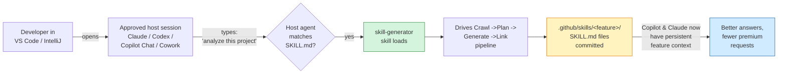
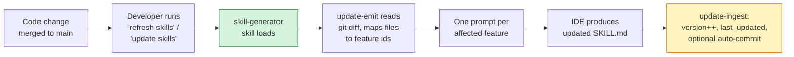

# Agent invocation flow

How a developer goes from opening their IDE to having generated `SKILL.md` files committed to the target repo. This is the visual companion to `skills/skill-generator/SKILL.md` (procedural instructions) and `AGENT.md` (full pipeline spec).

---

## At a glance



---

## Step by step

```mermaid
sequenceDiagram
    autonumber
    actor Dev as Developer
    participant IDE as IDE + AI panel<br/>(Claude / Codex / Copilot Chat / Cowork)
    participant CLI as skill-gen CLI<br/>(tools/skill_generator/)
    participant FS as Filesystem<br/>(target repo)

    rect rgb(240, 248, 255)
    Note over Dev,FS: Setup (once per machine)
    Dev->>FS: git clone FeatureBased_Skill_Generator_Agent
    Dev->>IDE: Open IDE with an approved AI assistant panel attached
    end

    rect rgb(255, 250, 230)
    Note over Dev,FS: Trigger the skill
    Dev->>IDE: "Analyze this project" / "Generate skills for this repo"
    IDE->>IDE: Matches against<br/>skills/skill-generator/SKILL.md description
    IDE-->>Dev: "Which Java repo? Confirm absolute path."
    Dev->>IDE: /path/to/the/java/repo
    end

    rect rgb(235, 250, 240)
    Note over Dev,FS: Stage 1 - Crawl (zero LLM turns)
    IDE->>CLI: python3 -m tools.skill_generator.cli crawl $TARGET
    CLI->>FS: walks .java / .xml / .yml / .sql / .sh
    CLI->>FS: writes .skill-gen/.index.json
    end

    rect rgb(255, 240, 240)
    Note over Dev,FS: Stage 2 - Plan (1 LLM turn)
    IDE->>CLI: plan-emit
    CLI->>FS: writes .skill-gen/plan-prompt.md
    IDE->>IDE: Reads prompt, produces plan JSON
    IDE->>FS: saves .skill-gen/plan-response.md
    IDE->>CLI: plan-ingest
    CLI->>FS: writes .skill-gen/.plan.json
    IDE-->>Dev: Shows domains; "Toggle/merge/rename, then approve"
    Dev->>IDE: Approves plan
    end

    rect rgb(255, 240, 240)
    Note over Dev,FS: Stage 3 - Generate (1 LLM turn per domain)
    IDE->>CLI: generate-emit
    CLI->>FS: one prompt per domain under .generate-prompts/
    loop for each approved domain
        IDE->>IDE: Produces SKILL.md (artifact-3 standard)
        IDE->>FS: saves .generate-responses/&lt;domain&gt;.md
    end
    IDE->>CLI: generate-ingest
    CLI->>FS: writes .github/skills/&lt;domain&gt;/SKILL.md
    end

    rect rgb(255, 240, 240)
    Note over Dev,FS: Stage 4 - Link (1 LLM turn)
    IDE->>CLI: link-emit
    CLI->>FS: writes .skill-gen/link-prompt.md
    IDE->>IDE: Identifies cross-domain dependencies
    IDE->>FS: saves link-response.md
    IDE->>CLI: link-ingest
    CLI->>FS: updates related_skills in each SKILL.md
    end

    IDE-->>Dev: "Done. N skills under .github/skills/"
    Dev->>FS: git add .github/skills && git commit
```

---

## In words

1. **Setup (once).** Clone this agent repo so the host agent — Claude, GitHub Copilot Chat, Codex, or Claude Cowork — can discover `skills/skill-generator/SKILL.md`.
2. **Trigger.** With your IDE open and an AI assistant panel active, type a phrase like *"analyze this project"*, *"scan this Java repo"*, or *"generate skills for this repo"*. The host agent matches the phrase against the skill's `description` field and loads it.
3. **Choose the host session.** For first-run generation on an unknown or legacy repo, prefer the strongest approved reasoning session. For routine updates, a normal team default is usually enough. See `docs/enterprise-agent-selection-guide.md`.
4. **Pre-flight.** The skill asks for the target repo's absolute path, confirms Python 3.10+, and asks whether to include tests.
5. **Pipeline.** The skill drives the Python CLI through Crawl -> Plan -> Generate -> Link. Stage 1 is deterministic (no LLM). Stages 2-4 each follow the same emit/ingest pattern: the CLI emits a prompt file, the IDE's AI panel produces the response, the CLI ingests it. **Every LLM turn happens inside the AI session you already pay for — no API keys, no outbound network calls.**
6. **Halt for plan review.** Stage 2 stops the pipeline so you can approve, edit, merge, or drop domains before any source code is shipped to Stage 3.
7. **Output.** One `SKILL.md` per business feature lands in `<target-repo>/.github/skills/<feature-id>/`. Commit those files and from then on Copilot/Claude/Codex start every conversation already knowing the feature — fewer premium-request iterations, more first-time-correct answers.

For a typical 10-domain repo, the whole run is about **12 LLM turns** (1 plan + 10 generate + 1 link), all inside one IDE session.

---

## Phase 2 — when code changes

After the initial skills are committed, the same flow applies to incremental updates — except `update-emit` reads `git diff` to figure out which features need refreshing, so only the affected SKILL.mds get regenerated. No re-planning unless a brand-new feature appears.


